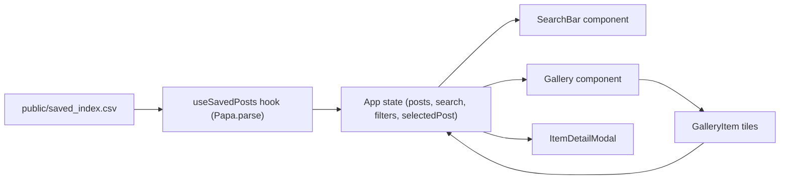

## Insta-Board Vite + React + TypeScript Plan

### Overview
Build a **local-only** Vite + React + TypeScript app that reads `saved_index.csv` and media files exported by Instaloader, then renders them in a Pinterest-style grid with **search** and a **detail modal**. All data remains on disk; the app only reads from `public/`.

### 1. Project scaffolding and dependencies
- **Initialize Vite + React + TypeScript** in your project folder (e.g. `/Users/christina/insta-board`), creating the standard Vite structure with `index.html`, `tsconfig.json`, `vite.config.ts`, `package.json`, and `src/`.
- **Entry files**:
  - Set up `[src/main.tsx](src/main.tsx)` to render the root `App` component.
  - Create `[src/App.tsx](src/App.tsx)` as the main layout container (top-level search + gallery + modal).
- **Install dependencies**:
  - `papaparse` for CSV loading on the client.
  - Optionally `react-masonry-css` for a simple responsive masonry layout, or implement CSS-based columns.

### 2. Wire up local data (CSV + media)
- **Static assets layout**:
  - Ensure `public/saved/` points at `/Users/christina/:saved` (using a symlink as you described) so Vite can serve media as `/saved/<filename>`.
  - Ensure `public/saved_index.csv` is a symlink or copy of your unified CSV (so it is accessible at `/saved_index.csv` from the browser).
- **Type definitions**:
  - Create `[src/types.ts](src/types.ts)` defining a `SavedPost` interface that matches the CSV columns (e.g. `shortcode`, `post_url`, `taken_at_iso`, `owner_username`, `is_video`, `hashtags`, `media_files`, etc.).
  - Handle string vs numeric fields (e.g. parse counts and timestamps where useful, but keep raw strings available).

### 3. CSV loading and state management
- **CSV loader hook**:
  - Implement a custom hook `[src/hooks/useSavedPosts.ts](src/hooks/useSavedPosts.ts)` that uses `Papa.parse("/saved_index.csv", { download: true, header: true, dynamicTyping: false })` in a `useEffect`.
  - Map `results.data` into `SavedPost[]` with light normalization (e.g. split `hashtags` into an array, split `media_files` into an array, coerce booleans for `is_video`, `has_audio`).
  - Expose `{ posts, loading, error }` from the hook for components to consume.
- **App-level state**:
  - In `App.tsx`, hold UI state: search query, selected item for modal, and any basic filter toggles (e.g. `videosOnly` for later use).
  - Derive a `filteredPosts` array from `posts` using the current search query and simple filters.

### 4. Core UI components
- **SearchBar** (`[src/components/SearchBar.tsx](src/components/SearchBar.tsx)`):
  - Controlled input field bound to the search query state in `App`.
  - Optional quick toggle buttons (e.g. “Videos only”) wired to boolean flags in `App`.
- **Gallery** (`[src/components/Gallery.tsx](src/components/Gallery.tsx)`):
  - Receives `posts: SavedPost[]` and a callback `onSelect(post)`.
  - Renders a responsive masonry-style grid using either CSS columns or `react-masonry-css`.
  - Each tile shows a thumbnail: first file from `media_files` mapped to `/saved/<filename>`.
  - For videos, show a simple play icon overlay or HTML5 `<video>` thumbnail (muted, `playsInline`, or still image if needed).
- **GalleryItem** (`[src/components/GalleryItem.tsx](src/components/GalleryItem.tsx)`):
  - Small presentational component for each tile, handling hover style and click to open details.
- **ItemDetailModal** (`[src/components/ItemDetailModal.tsx](src/components/ItemDetailModal.tsx)`):
  - Receives a `SavedPost | null` and an `onClose` callback.
  - Shows large media (image or video), full caption, parsed hashtags, owner info, and a link to `post_url`.
  - Implement as a fixed-position overlay with a semi-transparent backdrop (no portals required for MVP).

### 5. Search and filtering behavior (Level 1)
- **Search implementation**:
  - In `App`, implement a function that filters `posts` by checking the search query against `caption_text`, `hashtags`, `owner_username`, and `shortcode` (case-insensitive).
  - For `hashtags`, use both the raw string and a pre-split string array in `SavedPost` for easier matching.
- **Initial filters (optional but simple)**:
  - Add a “Videos only” toggle in `SearchBar` that filters `posts` to those with `is_video === true`.
  - Architect the filter logic in `App` so that future additions (owner filter, date range) are easy: a single `applyFilters(posts, filters)` function.

### 6. Styling and UX polish
- **Global styles**:
  - Use a single stylesheet `[src/styles.css](src/styles.css)` (or CSS modules) imported in `main.tsx`.
  - Implement a clean, neutral aesthetic: light background, subtle card shadows, rounded corners, and smooth hover transitions.
- **Masonry layout**:
  - Configure column count breakpoints (e.g. 1 column on mobile, 2–3 on tablet, 4–5 on desktop) for a Pinterest-like feel.
- **Modal UX**:
  - Close on backdrop click and `Esc` key.
  - Ensure scroll is locked behind the modal to avoid jank.

### 7. Future-ready structure (for later levels)
- Keep the data model (`types.ts` + `useSavedPosts`) clean and isolated so you can later:
  - Add advanced filters (by hashtag, owner, date range) in a `filters` module.
  - Add tagging/collections by layering additional local state or a simple local storage store.
  - Add AI features by introducing a separate service or backend without rewiring the core UI.

### High-level data flow (conceptual)

This structure keeps CSV parsing, state management, and presentational components clearly separated, making it easy to iterate on filters, layout, and future AI features.